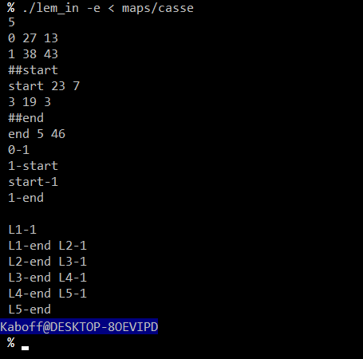

# Lem_in

Ce projet de l'école 42, à réaliser seul, est un projet d'algorithmie ayant pour but de trouver le chemin le plus court d'une map pour ramener X fourmis d'un point A à un point B.

## install & usage

~~~sh
git clone https://github.com/ale-floc/Lem_in.git ~/Lem_in
cd ~/Lem_in && make
~~~

~~~sh
./lem_in [-e] < [map]
~~~

## notice

Analyse d'une map
  - 5 <- nombre de fourmis
  
  - salle1 x y <- le nom de la salle suivi de son point X et Y
  
  - ##start <- la prochaine salle valide sera la salle de départ de la fourmilière
  
  - ##end <- la prochaine salle valide sera la fin de la fourmilière
  
  - #commentaires <- un commentaire
  
  - salle1-salle2 <- relie la salle1 à la salle2
