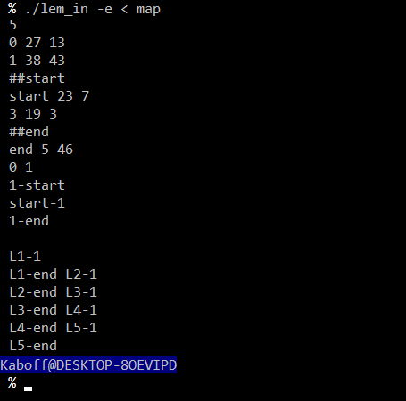

# Lem_in

Ce projet de l'école 42, à réaliser seul, est un projet d'algorithme ayant pour but de trouver le chemin le plus court d'une map pour ramener X fourmis d'un point A à un point B.

## install & usage

~~~sh
git clone https://github.com/kaboff/Lem_in.git ~/Lem_in
cd ~/Lem_in && make
~~~

~~~sh
./lem_in [-e] < [maps]
~~~
